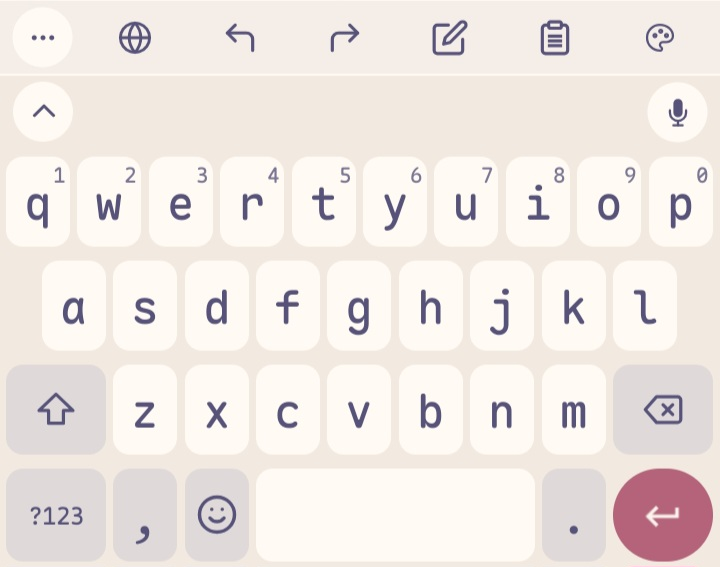

    
    <h2 align="center">Rosé Pine for FUTO Keyboard</h2>

All natural pine, faux fur and a bit of soho vibes for the classy minimalist

### Usage
1. Download the `*.zip` from the [releases](https://github.com/gatinSy/rose-pine-futo/releases)
2. Open **FUTO Keyboard**
3. Scroll down to **Themes**
4. Tap the plus icon and import the `*.zip`
5. Select the imported theme from the list

## Gallery

### Rosé Pine

### Rosé Pine Moon

### Rosé Pine Dawn

## Thanks to

- [Gatin](https://github.com/gatinSy)
